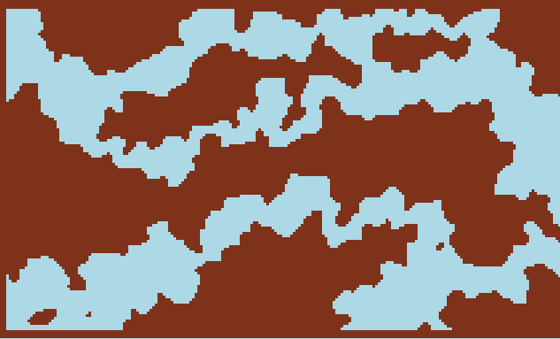

# javascript-terrain
Demonstrations of javascript procedural caves generation



# Simple example

- step 1
  Range grid x and y coords, a worm vector, create a point (eye) and reset period

  ```javascript
  this.cells.length = 32 * 32
  this.cell.fill(1) //fill with Solid
  
  var worm = {
    x: 0,
    y: 0
  }
  for (let x = 0; x < this.w; x++) {
    for (let y = 0; y < this.h; y++) {

      var period = 0

		  var eye = {
					x: 0,
					y: 0
		  }
  ```

- step 2
  For each period within a loop, randomize the direction of a point (eye)

  ```javascript
   while (period < 12) {
					
					eye.x += Math.cos(this.deg2rad(Math.random() * 360))
					eye.y += Math.cos(this.deg2rad(Math.random() * 180))

					eye.x += Math.pow(9, -2) //increment on direction x

					period ++
		}

    worm.x += eye.x
    worm.y += eye.y
  ```

- step 3
  Draw grid in a canvas. Ready!

```Javascript
    this.cells[Math.floor(worm.x) + Math.floor(worm.y) * 32] = 0 //dig with Air
  }
}
```
# Full Example


```javascript
const canvas = document.querySelector("canvas")
const gfx = canvas.getContext("2d")

gfx.clearRect(0,0,canvas.width, canvas.height)
gfx.fillStyle="lightblue"
gfx.fillRect(0,0,canvas.width,canvas.height)

var cells = new Array(128 * 128)
cells.fill(1)

var worm = {x: 0, y: 0}

for (let x = 0; x < 128; x++) {
	for (let y = 0; y < 128; y++) {
		var period = 0
		var eye = {x: 0, y: 0}

		while (period < 2) {

			eye.x += Math.cos(Math.random() * 360)
			eye.y += Math.sin(Math.random() * 180)

			eye.x += Math.pow(9, -2)

			period++
		}

		worm.x += eye.x
		worm.y += eye.y

		if (Math.floor(worm.x) < 0 || Math.floor(worm.y) < 0 || Math.floor(worm.y) >= 128 || Math.floor(worm.y) >= 128)
			continue

		cells[Math.floor(worm.x) + Math.floor(worm.y) * 128] = 0
	}
}

for (let x = 0; x < 128; x++) {
	for (let y = 0; y < 128; y++) {

		gfx.fillStyle = "white"

		if (cells[x + y * 128] == 1)
			gfx.fillStyle = "black"

		gfx.fillRect(x, y, 1, 1)
	}
}
```
